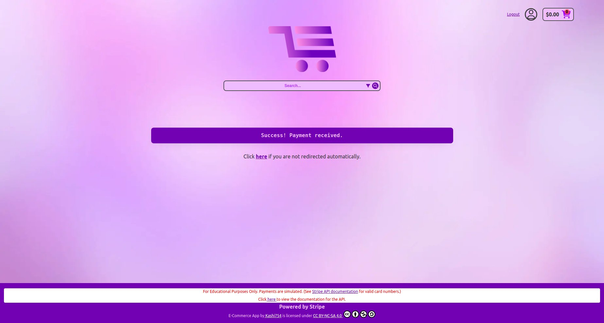
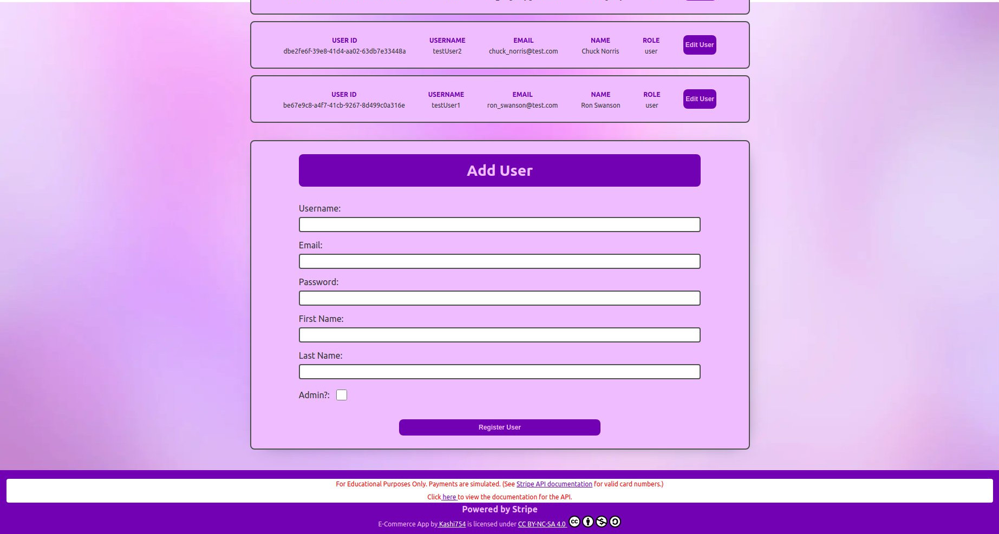

# Codecademy E-Commerce-App Portfolio Project

## Requirements

- Build a functioning e-commerce application using React, Node.js, and Postgres by extending your existing e-commerce REST API with an interactive client

- Use Git version control

- Use command line

- Develop locally on your computer

- Enable users to create a personal account

- Enable users to create an account with third-party service (Google, Facebook, etc)

- Enable users to browse products

- Enable users to complete a purchase using a payment processor (Stripe recommended)

- Enable users to view order history

- Publish the application to Render

## How it was built

### Base libraries/technologies

- React
- React Router
- Redux Toolkit

### Additional libraries/technologies

- FontAwesomeIcons
- Validator.js
- uiBall ldrs
- lob react-address-autocomplete
- stripe
- accounting-js
- text-mask-addons

## Features

The e-commerce-app is a single-page app (SPA) with a basic design that is accessible from desktop, tablet, and mobile devices with all modern browers.

Below is the apps home page, which users can search for browse products by category. The user may also search for products and filter them by price.

### Authorization

In order to successfully add items to their shopping cart and place orders, users must first register an account or log in if already registered. Authorization is available either through a standard (either username or email)/password combination, or via Oauth using Google.

There are two roles available to registered users on the app: **user** and **admin**. All users are automatically assigned the user role, whereas admin roles must be either manually set in the database or assigned to the user via the admin user page by an active admin.

### User

Once logged in, user's are automatically redirected back to the home page. and the header updates with information about the user's cart, and a icon that links to the user's profile.

Clicking on the user's profile icon takes the user to the user's profile page. Here they can view and edit their personal information, View past orders, and change their password.

Clicking on the order history link takes the user to a page where they can view a list of past orders showing when the orders were placed, the order total, payment status, shipping status, and tracking number if available.

Clicking on an individual order will take the user to a page with more detailed information about that specific order. This includes a link to the shippers tracking page, shipping information, and individual products that were ordered as well as their quantities and the price for that quantity of products.

#### Placing an order

When browsing user's may add a product to their cart by selecting the quantity they would like to add (defaults to 1) and clicking the Add to cart button in the product's description page. Once added the user can then either continue browsing, remove that item, or continue directly to checkout.

If the user clicks on the cart information icon in the top right, they will be taken to a page detailing information about their cart. Here the user can update product quantities, delete items from their cart and proceed to checkout. In the screenshot below notice that the product quantity was updated to 5 and the cart total price reflects accurately.

Upon navigating to the checkout page, users are prompted to enter the shipping address they would like to use. The user can either fill out all fields individually or the form uses lob react-address-autocomplete to suggest and automatically fill out the full form when providing input to the "Address" field.

Once an address is provided the user must then verify it to ensure that it is deliverable and select what shipping option they would like to use. After verification, if the user wishes, they may go back and make changes to their shipping address. The user will not be able to proceed to payment unless the address is considered "deliverable".

After clicking the "Go to payment" button, the user is taken to a page showing all items in their cart with the cart total reflecting an estimated shipping price, the selected shipping information, and a form where the user must input their payment information. Once a payment is submitted, the user is directed to a payment processing page, and the payment is processed by Stripe, once processed the user is presented with either a confirmation or declination and redirected to the home page.

### Admin

In addition to all the functionality available to customers, admins are also have access to a dedicated admin page accessible through the user profile page. Accessing the Admin Panel will bring the users to a page with links to perform various admin operations.

#### Users Actions

Clicking on users presents the admin with a list of users displaying information about each as well as a button to edit that user. User's can be searched for by email address or username, or filtered by role. A form is also available at the bottom to manually add a new user.

Clicking on the edit user button allows an admin to edit the user's email address, set their role to admin/user, or completely delete that user.

#### Orders Actions

Clicking on orders presents the admin with a list of all orders displaying information about each similar to an individual user's orders page (displays same information in addition to the Order Id, and can be clicked on to view detailed order information). Orders's can be searched for by Order Id or filtered by shipping status.

#### Inventory Actions

Clicking on inventory presents the admin with a form to add new products, and a listing of products searchable by product name or description and filterable just as the main website search is. Each product in the listing has a button that can be clicked to edit the individual information for that product including (name, price, quantity, image, description, and categories). For both the product add and product edit forms; when categories can either be selected from the dropdown or typed in (typed in categories are automatically added to the database when either enter or tab is hit). Products are not able to be deleted to ensure that past order's information stays correct. If the admin does not want the product visible on the main site, they need only set the quantity to 0.

## Links

- Repository: [https://github.com/Kashi754/e-commerce-app-frontend](https://github.com/Kashi754/e-commerce-app-frontend)
- API Repository: [https://github.com/Kashi754/e-commerce-API](https://github.com/Kashi754/e-commerce-API)
- Api Documentation: [https://e-commerce-app-frontend-e50n.onrender.com/docs](https://e-commerce-app-frontend-e50n.onrender.com/docs)
- Live Link: [https://e-commerce-app-frontend-e50n.onrender.com](https://e-commerce-app-frontend-e50n.onrender.com)

_Website may take up to a minute to respond on first page load due to the Render service suspending the api during periods of no use._

### Use it yourself

- User credentials:
  - Username: **user**
  - Password: **password**
    -Admin credentials:
  - Username: **admin**
  - Password: **password**

## Author

- GitHub: [@Kashi754](https://github.com/Kashi754)
- Website: [kashi754.com](https://www.kashi754.com)
